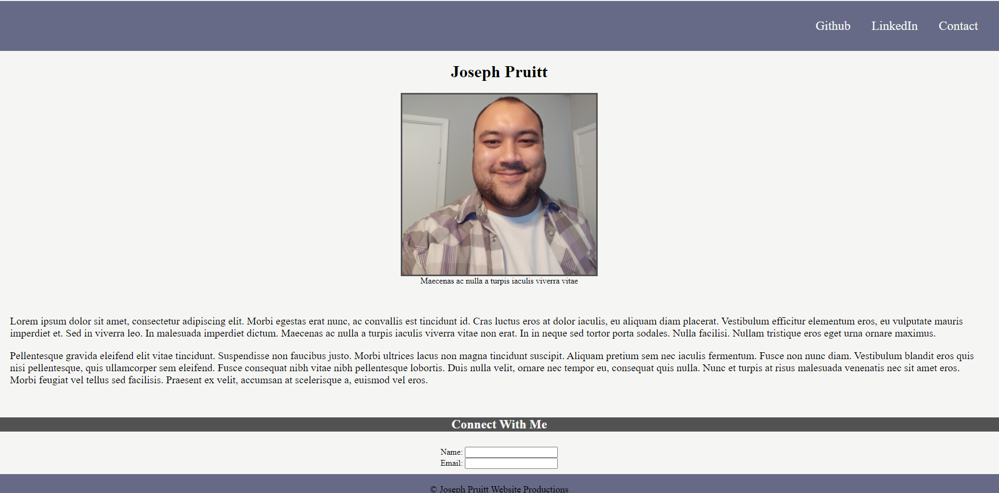

# Joseph Pruitt Landing Page

https://j92pruitt.github.io/jp-landing/

## Description
A simple landing page mock up that can be linked in future projects and on resumes.

## Conclusion
Through this project I was able to practice designing a simple webpage using HTML and CSS; in particular using components of the CSS box model and flexbox.